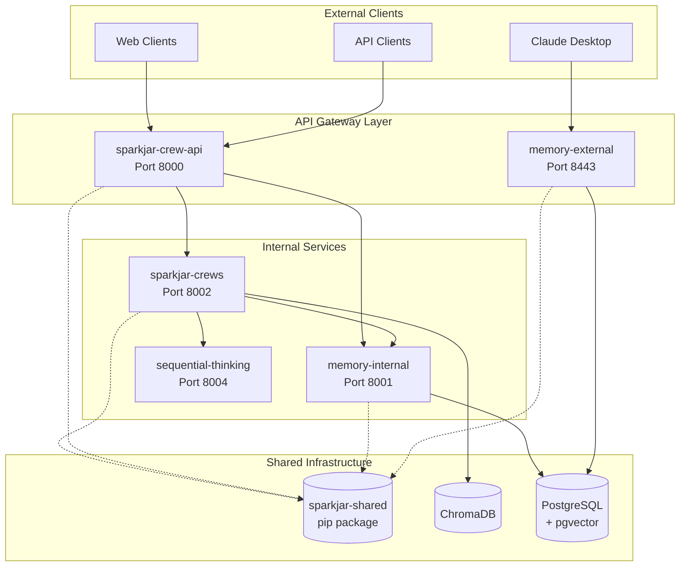

# Architecture Cleanup Design

## Overview

This document describes the target architecture for the SparkJAR platform after completing the monorepo split and cleanup. The design follows microservices principles with clear service boundaries, shared libraries, and well-defined communication patterns.

## Target Architecture

### Service Topology



### Repository Structure

```
GitHub Organization: SparkJAR/
├── sparkjar-crew-api/          # API Gateway & Orchestration
├── sparkjar-crews/             # All CrewAI Implementations  
├── sparkjar-memory-service/    # Memory Management (int/ext)
├── sparkjar-shared/            # Shared Library Package
```

## Service Definitions

### 1. sparkjar-crew-api (API Gateway)

**Purpose**: HTTP API gateway for crew job orchestration

**Responsibilities**:
- JWT authentication and authorization
- Job queue management and status tracking
- Request routing to appropriate crews
- Response aggregation and formatting
- Rate limiting and security

**Does NOT contain**:
- Crew implementations
- Direct database operations (except job tracking)
- Business logic

**Key Components**:
```
src/
├── api/
│   ├── routes/
│   │   ├── crew_routes.py      # POST /crew_job, GET /crew_job/{id}
│   │   ├── health_routes.py    # GET /health
│   │   └── auth_routes.py      # Authentication endpoints
│   └── middleware/
│       ├── auth.py             # JWT validation
│       └── logging.py          # Request logging
├── services/
│   ├── crew_client.py          # HTTP client for crews service
│   ├── job_service.py          # Job lifecycle management
│   └── queue_service.py        # Job queuing
└── models/
    └── api_models.py           # Request/Response schemas
```

### 2. sparkjar-crews (Crew Implementations)

**Purpose**: All CrewAI agent implementations

**Responsibilities**:
- Execute crew logic via CrewAI framework
- Use tools to interact with other services
- Return structured results
- Handle crew-specific errors

**Key Components**:
```
crews/
├── memory_maker_crew/
│   ├── config/
│   │   ├── agents.yaml
│   │   └── tasks.yaml
│   ├── crew.py
│   └── handler.py
├── book_translation_crew/
├── entity_research_crew/
└── book_ingestion_crew/

tools/
├── sj_memory_tool.py           # Via HTTP to memory service
├── sj_thinking_tool.py         # Via HTTP to thinking service
└── sj_document_tool.py         # Direct ChromaDB access

api/
├── server.py                   # FastAPI app
├── routes.py                   # POST /execute_crew
└── models.py                   # Crew execution models
```

### 3. sparkjar-shared (Shared Library)

**Purpose**: Common code shared across all services

**Distributed as**: pip package (private PyPI or GitHub packages)

**Contains**:
```
sparkjar_shared/
├── database/
│   ├── models.py              # All SQLAlchemy models
│   ├── connection.py          # Database connection logic
│   └── migrations/            # Alembic migrations
├── auth/
│   ├── jwt.py                 # Token creation/validation
│   └── scopes.py              # Permission definitions
├── schemas/
│   ├── memory_schemas.py      # Memory validation schemas
│   └── thinking_schemas.py    # Thinking validation schemas
├── config/
│   ├── settings.py            # Environment configuration
│   └── constants.py           # Shared constants
└── utils/
    ├── logging.py             # Structured logging
    └── validation.py          # Common validators
```

## Communication Patterns

### 1. Synchronous HTTP (Primary)

**When to use**: Real-time request/response (most operations)

**Implementation**:
```python
# In crew-api calling crews service
async def execute_crew(job_id: str, crew_name: str, inputs: dict):
    async with httpx.AsyncClient() as client:
        response = await client.post(
            f"{CREWS_SERVICE_URL}/execute_crew",
            json={
                "job_id": job_id,
                "crew_name": crew_name,
                "inputs": inputs
            },
            headers={"Authorization": f"Bearer {internal_token}"}
        )
    return response.json()
```

### 2. Service Discovery

**Simple Environment Variables**:
```python
# In sparkjar-shared/config/settings.py
from pydantic import BaseSettings

class Settings(BaseSettings):
    # Service URLs - configured via environment variables
    CREWS_SERVICE_URL: str = "http://sparkjar-crews.railway.internal:8002"
    MEMORY_SERVICE_URL: str = "http://memory-internal.railway.internal:8001"
    THINKING_SERVICE_URL: str = "http://sequential-thinking.railway.internal:8004"
    
    class Config:
        env_file = ".env"

settings = Settings()
```

### 3. Authentication Flow

**Internal Service Auth**:
- Services use long-lived JWT tokens with `sparkjar_internal` scope
- Tokens stored in environment variables
- No expiration for internal communication

**External Client Auth**:
- Short-lived tokens (1 hour)
- Refresh token mechanism
- Scope-based permissions

## Data Architecture

### 1. PostgreSQL (Supabase)
- Primary data store for all persistent data
- pgvector extension for embeddings
- Row-level security for multi-tenancy

### 2. ChromaDB
- Vector storage for CrewAI operations
- Document embeddings and retrieval
- Separate from application data

### 3. Data Flow
```
User Request → API Gateway → Job Queue (PostgreSQL)
                    ↓
               Crews Service → Memory Service → PostgreSQL
                    ↓              ↓
               ChromaDB      Thinking Service → PostgreSQL
```

## Deployment Architecture

### Railway Services

```yaml
services:
  sparkjar-crew-api:
    source: github.com/SparkJAR/sparkjar-crew-api
    port: 8000
    healthcheck: /health
    
  sparkjar-crews:
    source: github.com/SparkJAR/sparkjar-crews  
    port: 8002
    healthcheck: /health
    
  memory-internal:
    source: github.com/SparkJAR/sparkjar-memory-service
    port: 8001
    healthcheck: /health
    
  memory-external:
    source: github.com/SparkJAR/sparkjar-memory-service
    port: 8443
    healthcheck: /health
    env:
      - EXTERNAL_MODE=true
```

### Environment Variables

**Common (via Railway shared variables)**:
```
DATABASE_URL_DIRECT
OPENAI_API_KEY
CHROMA_URL
CHROMA_SERVER_AUTHN_CREDENTIALS
```

**Service-specific**:
```
# Crew API
CREWS_SERVICE_URL=http://sparkjar-crews.railway.internal:8002
MEMORY_SERVICE_URL=http://memory-internal.railway.internal:8001

# Crews Service  
MEMORY_SERVICE_URL=http://memory-internal.railway.internal:8001
THINKING_SERVICE_URL=http://sequential-thinking.railway.internal:8004
```

## Security Considerations

### 1. Network Isolation
- Internal services use Railway's private network
- Only API gateways exposed publicly
- All internal communication over HTTP (Railway handles TLS termination)

### 2. Authentication Layers
- External: OAuth2/JWT with refresh tokens
- Internal: Long-lived service tokens
- Database: Row-level security per client

### 3. Secrets Management
- Railway secret management for sensitive values
- No secrets in code or configs
- Rotation strategy for service tokens

## Migration Strategy

### Phase 1: Inter-Service Communication
- Implement HTTP endpoints in crews service
- Add crew client to API service
- Test with one crew (memory_maker)

### Phase 2: Gradual Migration
- Move crews one at a time
- Maintain backwards compatibility
- Feature flag for old vs new execution

### Phase 3: Cleanup
- Remove crews from API service
- Update all imports and dependencies
- Archive old code

## Benefits of This Architecture

1. **Independent Scaling**: Scale crews separately from API
2. **Clear Boundaries**: Each service has single responsibility  
3. **Technology Flexibility**: Could rewrite services in different languages
4. **Deployment Independence**: Deploy services individually
5. **Fault Isolation**: One service failure doesn't cascade
6. **Development Velocity**: Teams can work independently

## Considerations and Tradeoffs

1. **Network Latency**: HTTP calls between services add overhead
2. **Operational Complexity**: More services to monitor and deploy
3. **Debugging Complexity**: Distributed tracing needed
4. **Data Consistency**: Eventually consistent across services
5. **Development Setup**: More complex local environment

## Success Metrics

1. **Service Autonomy**: Each service can be deployed independently
2. **API Latency**: < 100ms overhead from service communication
3. **Development Speed**: New crews deployed without touching API
4. **System Reliability**: 99.9% uptime with graceful degradation
5. **Resource Efficiency**: 50% reduction in memory usage per service

## Documentation Analysis and Disposition

### Existing Documentation Inventory

#### 1. CLAUDE.md (Root Level)
**Current State**: Claims gpt-4.1 family models exist and work great
**Issues**: Contradicts OpenAI documentation and other project docs
**Disposition**: UPDATE - Change all gpt-4.1 references to valid models (gpt-4o-mini, gpt-4o)

#### 2. MONOREPO_SPLIT_COMPLETE.md
**Current State**: Shows 4-repo split as completed
**Issues**: Reality doesn't match - crews still in API
**Disposition**: UPDATE - Add "Phase 2 Required" section documenting remaining work

#### 3. MONOREPO_ANALYSIS.md  
**Current State**: Excellent analysis of why split was needed
**Issues**: None - accurate and valuable
**Disposition**: KEEP - Move to central architecture docs

#### 4. Individual Service READMEs
**Current State**: Each repo has README with varying detail
**Issues**: Inconsistent format, some outdated information
**Disposition**: STANDARDIZE - Create template and update all

#### 5. Railway Deployment Docs (Missing)
**Current State**: No comprehensive Railway deployment guide
**Issues**: Deployment knowledge is tribal/undocumented
**Disposition**: CREATE - New deployment guide needed

#### 6. API Documentation (Partial)
**Current State**: Some endpoints documented in CLAUDE.md
**Issues**: Not comprehensive, mixed with other content
**Disposition**: EXTRACT - Create dedicated API.md

#### 7. Tool Documentation
**Current State**: Some tools have README files, others don't
**Issues**: Inconsistent documentation quality
**Disposition**: STANDARDIZE - Every tool needs standard docs

### Proposed Documentation Structure

```
sparkjar-crew/                 # Main repository
├── ARCHITECTURE.md           # Master architecture document
├── DEPLOYMENT.md            # Railway deployment guide
├── API.md                   # Complete API reference
├── MIGRATION_GUIDE.md       # How to complete the cleanup
└── docs/
    ├── services/
    │   ├── crew-api.md      # Service-specific details
    │   ├── crews.md         # Crew implementation guide
    │   ├── memory.md        # Memory service details
    │   └── shared.md        # Shared library usage
    ├── development/
    │   ├── local-setup.md   # Local development guide
    │   ├── testing.md       # Testing strategies
    │   └── debugging.md     # Debugging distributed system
    └── archive/
        ├── MONOREPO_ANALYSIS.md     # Historical context
        └── original-claude.md        # Pre-cleanup version
```

### Documentation Cleanup Tasks

#### Phase 1: Consolidation (Week 1)
1. Create master ARCHITECTURE.md combining all architecture info
2. Extract API documentation from CLAUDE.md
3. Archive historical documents
4. Create service-specific guides

#### Phase 2: Correction (Week 2)
1. Fix all gpt-4.1 references across all docs
2. Update import paths in examples
3. Correct service URLs and ports
4. Align README files with reality

#### Phase 3: Enhancement (Week 3)
1. Add deployment playbooks
2. Create troubleshooting guides
3. Document monitoring/alerting
4. Add architecture diagrams

### Documentation Standards

#### Every Service Must Have:
1. **README.md** - Overview, quick start, basic usage
2. **DEVELOPMENT.md** - Local setup, testing, debugging
3. **API.md** - All endpoints, models, examples
4. **DEPLOYMENT.md** - Environment vars, dependencies
5. **CHANGELOG.md** - Version history

#### Documentation Rules:
1. **Single Source of Truth** - No duplicate information
2. **Living Documents** - Updated with each PR
3. **Examples Required** - Every feature needs example
4. **Versioned** - Documentation tagged with releases
5. **Searchable** - Consistent terminology

### Model Name Resolution

**Current Conflict**:
- CLAUDE.md: "gpt-4.1-mini exists and works great"
- Other docs: "Use gpt-4o-mini, not gpt-4.1"

**Resolution Strategy**:
1. Check with OpenAI API to verify available models
2. If gpt-4.1 doesn't exist: Update CLAUDE.md
3. If gpt-4.1 does exist: Update other docs
4. Create MODELS.md with authoritative list

**Proposed MODELS.md**:
```markdown
# Approved LLM Models

## OpenAI Models (Verified 2025-01-27)
- gpt-4o: Multimodal, high performance
- gpt-4o-mini: Balanced cost/performance  
- gpt-4-turbo: Previous generation
- gpt-3.5-turbo: Fast, economical

## Model Selection Guide
- Complex reasoning: gpt-4o
- Standard crews: gpt-4o-mini
- High volume: gpt-3.5-turbo
- Vision tasks: gpt-4o (required)
```