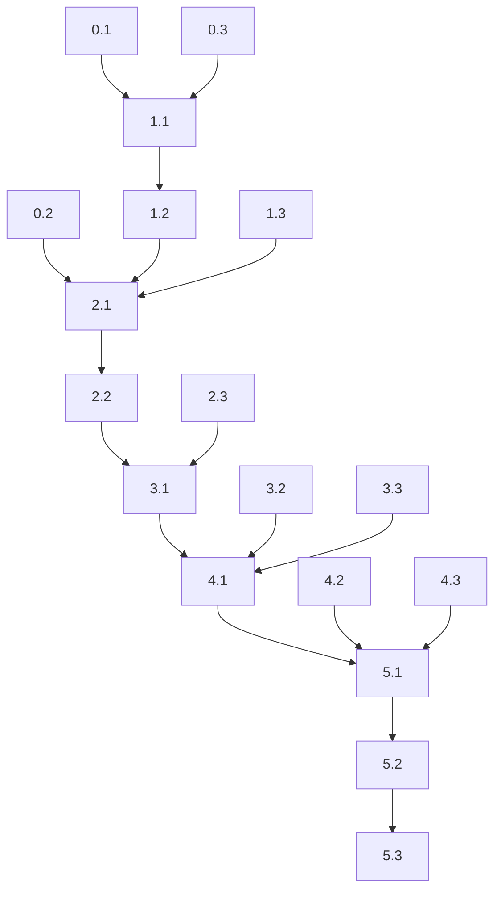

# Architecture Cleanup Tasks

## Overview

This document outlines the step-by-step tasks required to complete the architecture cleanup and monorepo split. Tasks are organized in phases with clear dependencies and verification steps.

## Phase 0: Preparation and Planning (3 days)

- [ ] **Task 0.0: Repository Cleanup Blitz**
  **Priority**: Critical
  **Owner**: All Teams
  **Duration**: 1 day

  **Description**: Clean up the "cocaine coder's seed spreading" mess across all repositories

  - [ ] **Root Repository Cleanup**
    - [ ] Move all test_*.py files to appropriate tests/ directories
    - [ ] Move run_*.py, execute_*.py scripts to scripts/legacy/
    - [ ] Archive or delete baron_*.* files (document purpose first)
    - [ ] Create proper directory structure:
    ```
    sparkjar-crew/
    ├── scripts/          # Utility scripts
    ├── tests/           # Test files
    ├── docs/            # Documentation
    ├── config/          # Configuration files
    └── sandbox/         # Experimental code
    ```

  - [ ] **_reorg/sparkjar-crews Cleanup**
    - [ ] Remove duplicate test files from root
    - [ ] Organize baron ingestion files
    - [ ] Clean up random utility scripts
    - [ ] Archive old crew versions

  - [ ] **_reorg/sparkjar-crew-api Cleanup**
    - [ ] Remove crews that belong in crews service
    - [ ] Clean up test files in src/
    - [ ] Organize scripts properly

  - [ ] **_reorg/sparkjar-memory-service Cleanup**
    - [ ] Consolidate test files
    - [ ] Remove experimental scripts
    - [ ] Organize utilities

  - [ ] **_reorg/sparkjar-shared Cleanup**
    - [ ] Ensure only library code remains
    - [ ] Move scripts to appropriate repos
    - [ ] Clean up test organization

**File Disposition Plan**:
```
Baron-related files:
  baron_*.* → archive/baron_manuscript/ (with README explaining purpose)

Test files:
  test_*.py → tests/ (in appropriate repo)

Execution scripts:
  run_*.py → scripts/execution/
  execute_*.py → scripts/execution/
  resume_*.py → scripts/execution/

Random scripts:
  *.py (not in proper location) → scripts/legacy/ or delete

Log files:
  *.log → Delete (shouldn't be in git)

Temporary files:
  *_backup.*, *_old.* → Delete
```

  **Verification**: 
  - Root directories contain only essential files
  - All scripts organized in proper directories
  - Clear README in each directory explaining contents

- [ ] **Task 0.1: Create Architecture Documentation**
  **Priority**: Critical
  **Owner**: Architecture Team
  **Duration**: 2 days

  - [ ] Create master ARCHITECTURE.md file
  - [ ] Document current state with diagrams
  - [ ] Document target state with diagrams
  - [ ] List all services and their responsibilities
  - [ ] Get stakeholder approval on target architecture

  **Verification**: Architecture document reviewed and approved

- [ ] **Task 0.2: Inventory Existing Crews**
  **Priority**: High
  **Owner**: Development Team
  **Duration**: 1 day

  - [ ] List all crews in sparkjar-crew-api/src/crews/
  - [ ] List all crews in sparkjar-crews/crews/
  - [ ] Identify duplicates and divergent implementations
  - [ ] Create crew migration priority list
  - [ ] Document crew dependencies

  **Verification**: Complete inventory spreadsheet created

- [ ] **Task 0.3: Set Up Testing Environment**
  **Priority**: High
  **Owner**: DevOps Team
  **Duration**: 1 day

  - [ ] Create staging Railway environment
  - [ ] Clone production data (sanitized)
  - [ ] Set up monitoring for staging
  - [ ] Create rollback procedures
  - [ ] Document staging access

  **Verification**: Staging environment accessible and functional

## Phase 1: Foundation Work (1 week)

- [ ] **Task 1.1: Implement Crews Service API**
  **Priority**: Critical  
  **Owner**: Backend Team  
  **Duration**: 3 days

  **Description**: Create HTTP API endpoints in sparkjar-crews service to handle crew execution requests from the API gateway.

  **Implementation Details**:
```python
# Create in sparkjar-crews/api/server.py
from fastapi import FastAPI, HTTPException, Depends
from sparkjar_shared.auth import verify_internal_token
from sparkjar_shared.schemas import CrewExecutionRequest, CrewExecutionResponse

app = FastAPI(title="SparkJAR Crews Service")

@app.post("/execute_crew", response_model=CrewExecutionResponse)
async def execute_crew(
    request: CrewExecutionRequest,
    token: str = Depends(verify_internal_token)
):
    """Execute a crew with the provided inputs"""
    # Load crew dynamically based on crew_name
    # Execute crew with inputs
    # Return structured results
    pass

@app.get("/health")
async def health_check():
    return {"status": "healthy", "service": "sparkjar-crews"}
```

  **Tasks**:
  - [ ] Create FastAPI application structure in sparkjar-crews/api/
  - [ ] Implement /execute_crew endpoint with proper error handling
  - [ ] Add JWT authentication middleware using sparkjar-shared
  - [ ] Create request/response models in sparkjar-shared/schemas/
  - [ ] Add health check endpoint for Railway monitoring
  - [ ] Write unit tests for all endpoints
  - [ ] Add logging and request tracing

  **Verification**: Can execute test crew via HTTP and receive structured response  
  **Requirements**: _Requirement 1.3, 2.1_

- [ ] **Task 1.2: Create Crew Client in API Service**
  **Priority**: Critical
  **Owner**: Backend Team
  **Duration**: 2 days

  **Description**: Create HTTP client in the API service to communicate with the crews service.

  **Implementation Details**:
```python
# Create in sparkjar-crew-api/src/services/crew_client.py
import httpx
from typing import Dict, Any
from sparkjar_shared.config import settings
from sparkjar_shared.auth import get_internal_token

class CrewClient:
    def __init__(self):
        self.base_url = settings.CREWS_SERVICE_URL
        self.timeout = httpx.Timeout(30.0, connect=5.0)
        
    async def execute_crew(self, crew_name: str, inputs: Dict[str, Any]) -> Dict[str, Any]:
        """Execute a crew via HTTP call to crews service"""
        async with httpx.AsyncClient(timeout=self.timeout) as client:
            response = await client.post(
                f"{self.base_url}/execute_crew",
                json={
                    "crew_name": crew_name,
                    "inputs": inputs
                },
                headers={"Authorization": f"Bearer {get_internal_token()}"}
            )
            response.raise_for_status()
            return response.json()
```

  **Tasks**:
  - [ ] Implement CrewClient class with proper error handling
  - [ ] Add retry logic with exponential backoff (3 retries max)
  - [ ] Add timeout handling (30s total, 5s connect)
  - [ ] Create error mapping from HTTP status codes
  - [ ] Add structured logging and request tracing
  - [ ] Write integration tests with mock crews service
  - [ ] Add connection pooling configuration

  **Verification**: API can call crews service successfully with proper error handling  
  **Requirements**: _Requirement 1.3, 2.2_

- [ ] **Task 1.3: Update sparkjar-shared Package**
  **Priority**: High
  **Owner**: Platform Team
  **Duration**: 2 days

  - [ ] Ensure all database models are in shared
  - [ ] Add crew-specific utilities to shared
  - [ ] Update setup.py with new modules
  - [ ] Test package installation
  - [ ] Publish to private registry
  - [ ] Update all services to use latest version

  **Verification**: All services can import from sparkjar-shared

## Phase 2: Crew Migration - Stage 1 (1 week)

- [ ] **Task 2.1: Migrate memory_maker_crew (Pilot)**
  **Priority**: Critical
  **Owner**: Crew Team
  **Duration**: 3 days

  - [ ] Copy crew from API to crews service
  - [ ] Update imports to use sparkjar-shared
  - [ ] Modify tools to use HTTP calls
  - [ ] Update crew handler for new structure
  - [ ] Test crew execution via API
  - [ ] Update crew registry

  **Steps**:
  1. Copy files to sparkjar-crews/crews/memory_maker_crew/
  2. Update imports in all files
  3. Modify handler to work with new API
  4. Test extensively in staging
  5. Document any issues found

  **Verification**: Memory maker crew works via new architecture

- [ ] **Task 2.2: Implement Feature Flag System**
  **Priority**: High
  **Owner**: Backend Team
  **Duration**: 2 days

  **Description**: Create feature flag system to enable gradual rollout of remote crew execution with ability to rollback instantly.

  **Implementation Details**:
```python
# In sparkjar-crew-api/src/services/feature_flags.py
from sparkjar_shared.config import settings
from typing import Dict, Any

class FeatureFlags:
    def __init__(self):
        self.flags = settings.FEATURE_FLAGS or {}
    
    def is_enabled(self, flag_name: str, crew_name: str = None) -> bool:
        """Check if feature flag is enabled, optionally per crew"""
        if crew_name and f"{flag_name}_{crew_name}" in self.flags:
            return self.flags[f"{flag_name}_{crew_name}"]
        return self.flags.get(flag_name, False)

# In crew-api job service
feature_flags = FeatureFlags()

async def execute_crew_job(crew_name: str, inputs: Dict[str, Any]):
    if feature_flags.is_enabled("use_remote_crews", crew_name):
        result = await crew_client.execute_crew(crew_name, inputs)
    else:
        result = await legacy_crew_executor.execute(crew_name, inputs)
    return result
```

  **Tasks**:
  - [ ] Create FeatureFlags class with per-crew support
  - [ ] Implement flag checking in job service execution path
  - [ ] Add admin endpoint to toggle flags (POST /admin/feature-flags)
  - [ ] Create environment variable configuration for flags
  - [ ] Add monitoring and metrics for flag usage
  - [ ] Create flag management documentation
  - [ ] Add tests for flag behavior

  **Verification**: Can toggle between old and new execution per crew  
  **Requirements**: _Requirement 5.1, 5.2_

- [ ] **Task 2.3: Update Monitoring and Logging**
  **Priority**: Medium
  **Owner**: DevOps Team
  **Duration**: 2 days

  - [ ] Add distributed tracing setup
  - [ ] Configure log aggregation
  - [ ] Create crew execution dashboards
  - [ ] Set up alerts for failures
  - [ ] Document monitoring procedures
  - [ ] Train team on new tools

  **Verification**: Can trace requests across services

## Phase 3: Crew Migration - Stage 2 (2 weeks)

- [ ] **Task 3.1: Migrate Remaining Production Crews**
  **Priority**: High
  **Owner**: Crew Team
  **Duration**: 1 week

  For each crew:
  - [ ] entity_research_crew
    - [ ] Copy to crews service
    - [ ] Update imports and tools
    - [ ] Test in staging
    - [ ] Enable feature flag
    - [ ] Monitor for 24 hours
    
  - [ ] book_ingestion_crew
    - [ ] Copy to crews service
    - [ ] Update imports and tools
    - [ ] Test with sample book
    - [ ] Enable feature flag
    - [ ] Monitor performance

  - [ ] book_translation_crew
    - [ ] Copy to crews service
    - [ ] Fix model references (gpt-4.1 → gpt-4o-mini)
    - [ ] Update imports and tools
    - [ ] Test with sample pages
    - [ ] Enable feature flag

  **Verification**: All crews functional in new architecture

- [ ] **Task 3.2: Update Database Schema**
  **Priority**: Medium
  **Owner**: Database Team
  **Duration**: 3 days

  - [ ] Add service_name column to crew_jobs
  - [ ] Update job tracking for distributed execution
  - [ ] Add migration scripts
  - [ ] Test rollback procedures
  - [ ] Update ORM models in shared
  - [ ] Deploy to production

  **Verification**: Database supports new architecture

- [ ] **Task 3.3: Update CI/CD Pipelines**
  **Priority**: High
  **Owner**: DevOps Team
  **Duration**: 3 days

  - [ ] Create GitHub Actions for crews repo
  - [ ] Set up automated testing
  - [ ] Configure Railway auto-deploy
  - [ ] Add security scanning
  - [ ] Create release procedures
  - [ ] Document deployment process

  **Verification**: Automated deployments working

## Phase 4: Cleanup and Documentation (1 week)

- [ ] **Task 4.1: Remove Crews from API Service**
  **Priority**: Medium
  **Owner**: Backend Team
  **Duration**: 2 days

  - [ ] Verify all flags point to remote crews
  - [ ] Remove src/crews/ directory
  - [ ] Remove crew-specific dependencies
  - [ ] Update imports and references
  - [ ] Clean up unused code
  - [ ] Run full test suite

  **Verification**: API service no longer contains crews

- [ ] **Task 4.2: Update All Documentation**
  **Priority**: High
  **Owner**: Documentation Team
  **Duration**: 3 days

  - [ ] Update CLAUDE.md (fix gpt-4.1 references)
  - [ ] Update all README files
  - [ ] Create deployment guides
  - [ ] Update API documentation
  - [ ] Create troubleshooting guides
  - [ ] Archive old documentation

  **Verification**: Documentation audit complete

- [ ] **Task 4.3: Performance Optimization**
  **Priority**: Medium
  **Owner**: Performance Team
  **Duration**: 2 days

  - [ ] Profile service communication
  - [ ] Optimize HTTP client settings
  - [ ] Add connection pooling
  - [ ] Tune timeout values
  - [ ] Add caching where appropriate
  - [ ] Document performance metrics

  **Verification**: Meeting performance SLAs

## Phase 5: Production Rollout (1 week)

- [ ] **Task 5.1: Production Deployment Planning**
  **Priority**: Critical
  **Owner**: Operations Team
  **Duration**: 1 day

  - [ ] Create deployment runbook
  - [ ] Schedule deployment window
  - [ ] Notify stakeholders
  - [ ] Prepare rollback plan
  - [ ] Brief support team
  - [ ] Create incident response plan

  **Verification**: Deployment plan approved

- [ ] **Task 5.2: Execute Production Deployment**
  **Priority**: Critical
  **Owner**: Operations Team
  **Duration**: 1 day

  - [ ] Deploy crews service
  - [ ] Update crew-api service
  - [ ] Enable feature flags gradually
  - [ ] Monitor error rates
  - [ ] Check performance metrics
  - [ ] Verify all crews functional

  **Verification**: All services running in production

- [ ] **Task 5.3: Post-Deployment Validation**
  **Priority**: High
  **Owner**: QA Team
  **Duration**: 3 days

  - [ ] Run smoke tests
  - [ ] Execute full regression suite
  - [ ] Verify monitoring working
  - [ ] Check log aggregation
  - [ ] Test crew execution paths
  - [ ] Document any issues

  **Verification**: Production validation complete

## Task Dependencies



## Success Criteria

### Phase 0 Success
- Complete architecture documentation
- Full crew inventory created
- Staging environment operational

### Phase 1 Success
- Crews service API functional
- Can execute test crew remotely
- sparkjar-shared updated

### Phase 2 Success
- memory_maker_crew working remotely
- Feature flags operational
- Monitoring in place

### Phase 3 Success
- All crews migrated
- Database schema updated
- CI/CD pipelines working

### Phase 4 Success
- API service cleaned up
- Documentation updated
- Performance optimized

### Phase 5 Success
- Production deployment complete
- All crews functional
- No service degradation

## Risk Mitigation

For each phase:
1. Test extensively in staging
2. Use feature flags for gradual rollout
3. Monitor closely after changes
4. Keep rollback procedures ready
5. Document all issues encountered