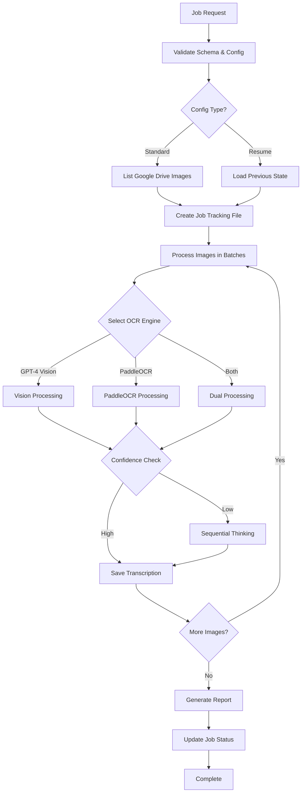

# Book Ingestion Crew Enhancement Design

## Overview

This design enhances the book ingestion crew to production standards while adding robust OCR capabilities, improved error handling, and scalable processing. The approach maintains backward compatibility while introducing new features through configuration options. The design emphasizes reliability, monitoring, and flexibility to handle various manuscript types and languages.

## Architecture

### Enhanced Component Architecture

```
┌─────────────────────────────────────────────────────────────────┐
│                        Book Ingestion Crew                       │
├─────────────────────────────────────────────────────────────────┤
│                          Job Handler                             │
│  ┌─────────────┐  ┌──────────────┐  ┌─────────────────────┐   │
│  │   Schema    │  │    Config    │  │   Error Handler     │   │
│  │ Validation  │  │   Manager    │  │  & Retry Logic      │   │
│  └─────────────┘  └──────────────┘  └─────────────────────┘   │
├─────────────────────────────────────────────────────────────────┤
│                      OCR Engine Manager                          │
│  ┌─────────────┐  ┌──────────────┐  ┌─────────────────────┐   │
│  │ GPT-4 Vision│  │  PaddleOCR   │  │  Sequential         │   │
│  │   Engine    │  │   Engine     │  │  Thinking Tool      │   │
│  └─────────────┘  └──────────────┘  └─────────────────────┘   │
├─────────────────────────────────────────────────────────────────┤
│                    Google Drive Manager                          │
│  ┌─────────────┐  ┌──────────────┐  ┌─────────────────────┐   │
│  │   Folder    │  │    Batch     │  │   Rate Limit        │   │
│  │  Navigator  │  │  Processor   │  │    Handler          │   │
│  └─────────────┘  └──────────────┘  └─────────────────────┘   │
├─────────────────────────────────────────────────────────────────┤
│                    Progress Tracker                              │
│  ┌─────────────┐  ┌──────────────┐  ┌─────────────────────┐   │
│  │    State    │  │   Metrics    │  │    Reporting        │   │
│  │   Manager   │  │  Collector   │  │    Generator        │   │
│  └─────────────┘  └──────────────┘  └─────────────────────┘   │
└─────────────────────────────────────────────────────────────────┘
```

### Processing Flow



## Components and Interfaces

### Enhanced Job Handler

```python
class EnhancedBookIngestionHandler(BaseCrewHandler):
    """Enhanced handler with production-ready features."""
    
    def __init__(self):
        self.config_manager = ConfigurationManager()
        self.error_handler = ErrorHandler()
        self.progress_tracker = ProgressTracker()
        self.ocr_manager = OCREngineManager()
        self.drive_manager = GoogleDriveManager()
    
    async def execute(self, request_data: Dict[str, Any]) -> Dict[str, Any]:
        """Execute with comprehensive error handling and progress tracking."""
        
    async def validate_and_prepare(self, request_data: Dict[str, Any]) -> ProcessingConfig:
        """Validate request and prepare processing configuration."""
        
    async def process_with_resume(self, config: ProcessingConfig) -> ProcessingResult:
        """Process with support for resuming interrupted jobs."""
```

### OCR Engine Manager

```python
class OCREngineManager:
    """Manages multiple OCR engines with fallback and confidence scoring."""
    
    def __init__(self):
        self.gpt_vision = GPTVisionEngine()
        self.paddle_ocr = PaddleOCREngine()
        self.confidence_threshold = 0.8
    
    async def transcribe_image(
        self, 
        image_path: str, 
        config: OCRConfig,
        context: Optional[str] = None
    ) -> TranscriptionResult:
        """Transcribe image using configured OCR engine(s)."""
        
    async def apply_preprocessing(self, image_path: str) -> str:
        """Apply image preprocessing for better OCR results."""
        
    def calculate_confidence(self, result: TranscriptionResult) -> float:
        """Calculate confidence score for transcription."""
```

### Google Drive Manager

```python
class GoogleDriveManager:
    """Enhanced Google Drive operations with pagination and rate limiting."""
    
    def __init__(self):
        self.drive_tool = GoogleDriveTool()
        self.upload_tool = SimpleFileUploadTool()
        self.rate_limiter = RateLimiter(calls_per_minute=60)
        
    async def list_images_paginated(
        self, 
        folder_id: str, 
        page_size: int = 100
    ) -> AsyncIterator[List[DriveFile]]:
        """List images with pagination support."""
        
    async def download_with_retry(
        self, 
        file_id: str, 
        max_retries: int = 3
    ) -> bytes:
        """Download file with exponential backoff retry."""
        
    async def create_output_structure(
        self, 
        job_id: str, 
        parent_folder_id: str
    ) -> OutputFolders:
        """Create organized output folder structure."""
```

### Progress Tracker

```python
class ProgressTracker:
    """Tracks job progress with persistence and metrics."""
    
    def __init__(self, job_id: str):
        self.job_id = job_id
        self.state = ProcessingState()
        self.metrics = MetricsCollector()
        
    async def update_progress(
        self, 
        current_image: int, 
        total_images: int,
        status: str
    ):
        """Update and persist progress state."""
        
    async def record_metric(
        self, 
        metric_name: str, 
        value: float,
        tags: Dict[str, str]
    ):
        """Record performance and quality metrics."""
        
    def generate_report(self) -> ProcessingReport:
        """Generate comprehensive processing report."""
```

## Data Models

### Configuration Models

```python
@dataclass
class ProcessingConfig:
    job_id: str
    folder_id: str
    output_folder_id: str
    language: str = "auto"
    ocr_engine: Literal["gpt4_vision", "paddle", "both"] = "gpt4_vision"
    batch_size: int = 10
    confidence_threshold: float = 0.8
    output_format: Literal["text", "markdown", "json"] = "markdown"
    preprocessing_enabled: bool = True
    resume_from_image: Optional[int] = None
    custom_settings: Dict[str, Any] = field(default_factory=dict)

@dataclass
class OCRConfig:
    engine: str
    language: str
    preprocessing: bool
    confidence_threshold: float
    custom_params: Dict[str, Any]

@dataclass
class TranscriptionResult:
    text: str
    confidence: float
    engine_used: str
    processing_time: float
    warnings: List[str]
    metadata: Dict[str, Any]
```

### State Management Models

```python
@dataclass
class ProcessingState:
    job_id: str
    total_images: int
    processed_images: int
    failed_images: List[str]
    current_batch: int
    last_processed_index: int
    start_time: datetime
    last_checkpoint: datetime
    
@dataclass
class ProcessingMetrics:
    total_processing_time: float
    average_ocr_time: float
    success_rate: float
    average_confidence: float
    engines_used: Dict[str, int]
    errors_encountered: Dict[str, int]
```

### Output Models

```python
@dataclass
class ProcessingReport:
    job_id: str
    status: Literal["completed", "partial", "failed"]
    total_images: int
    successful_transcriptions: int
    failed_transcriptions: int
    processing_time: float
    average_confidence: float
    output_location: str
    errors: List[ErrorDetail]
    warnings: List[str]
    metrics: ProcessingMetrics
```

## Error Handling

### Error Categories and Recovery

1. **Transient Errors** (Retry with backoff)
   - Network timeouts
   - API rate limits
   - Temporary service unavailability
   - Memory pressure

2. **Input Errors** (Skip and report)
   - Corrupted images
   - Unsupported formats
   - Access permission issues
   - Invalid file types

3. **Configuration Errors** (Fail fast)
   - Invalid API credentials
   - Missing required settings
   - Schema validation failures
   - Invalid language codes

4. **System Errors** (Graceful degradation)
   - OCR engine failures
   - Database connection issues
   - Disk space exhaustion
   - Memory limits exceeded

### Error Handler Implementation

```python
class ErrorHandler:
    """Comprehensive error handling with recovery strategies."""
    
    async def handle_with_retry(
        self,
        operation: Callable,
        error_type: ErrorType,
        max_retries: int = 3,
        backoff_factor: float = 2.0
    ) -> Any:
        """Execute operation with exponential backoff retry."""
        
    def classify_error(self, error: Exception) -> ErrorType:
        """Classify error to determine handling strategy."""
        
    async def record_error(
        self,
        error: Exception,
        context: Dict[str, Any]
    ):
        """Record error with full context for debugging."""
```

## Testing Strategy

### Unit Testing

```python
class TestOCREngineManager:
    """Test OCR engine manager functionality."""
    
    @pytest.fixture
    def mock_engines(self):
        """Mock OCR engines for testing."""
        
    async def test_engine_selection(self):
        """Test proper engine selection based on config."""
        
    async def test_confidence_fallback(self):
        """Test fallback to sequential thinking on low confidence."""
        
    async def test_preprocessing_pipeline(self):
        """Test image preprocessing improves OCR results."""
```

### Integration Testing

```python
class TestGoogleDriveIntegration:
    """Test Google Drive operations with real API."""
    
    @pytest.fixture
    def test_folder(self):
        """Create test folder in Google Drive."""
        
    async def test_pagination_handling(self):
        """Test pagination with 100+ files."""
        
    async def test_rate_limit_handling(self):
        """Test graceful handling of rate limits."""
```

### Performance Testing

```python
class TestPerformance:
    """Test performance under various conditions."""
    
    async def test_large_batch_processing(self):
        """Test processing 1000+ images."""
        
    async def test_memory_usage(self):
        """Test memory usage stays within limits."""
        
    async def test_concurrent_processing(self):
        """Test concurrent image processing."""
```

## Implementation Approach

### Phase 1: Core Infrastructure (Days 1-2)
- Set up enhanced error handling
- Implement configuration management
- Create progress tracking system
- Add comprehensive logging

### Phase 2: OCR Enhancement (Days 3-4)
- Integrate PaddleOCR engine
- Implement confidence scoring
- Add preprocessing pipeline
- Create engine selection logic

### Phase 3: Google Drive Enhancement (Days 5-6)
- Implement pagination support
- Add rate limit handling
- Create output folder structure
- Enhance error recovery

### Phase 4: Testing and Validation (Days 7-8)
- Write comprehensive unit tests
- Create integration test suite
- Perform load testing
- Document all features

## Success Metrics

1. **Code Quality**
   - 100% test coverage for critical paths
   - Zero production-blocking issues
   - All code review criteria met

2. **Performance**
   - Process 100 images in under 10 minutes
   - Handle 1000+ image folders without timeout
   - Maintain <500MB memory usage

3. **Reliability**
   - 99% success rate for valid images
   - Graceful handling of all error cases
   - Successful resume from interruptions

4. **Accuracy**
   - >90% OCR accuracy on clear handwriting
   - >70% accuracy on challenging manuscripts
   - Proper confidence scoring

## Dependencies and Constraints

### External Dependencies
- OpenAI API (GPT-4 Vision)
- Google Drive API
- PaddleOCR library
- Database for job tracking

### Technical Constraints
- Google Drive API rate limits (60 requests/minute)
- GPT-4 Vision API limits
- Maximum image size constraints
- Memory limitations on Railway

### Resource Constraints
- Processing time budget per job
- Storage for temporary files
- API cost considerations