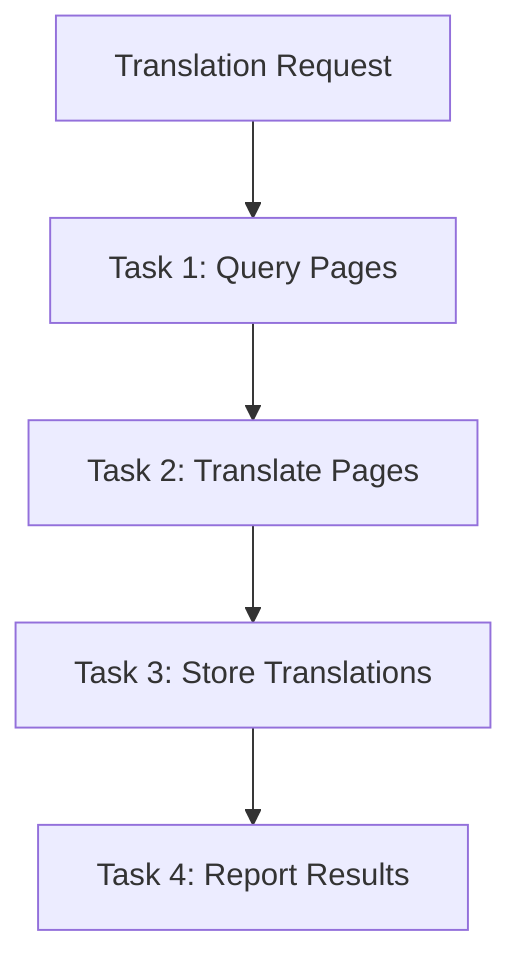

# Design Document

## Overview

The Book Translation Crew is a **separate, standalone crew** that translates previously ingested books. It follows standard CrewAI patterns with proper agents and tasks, avoiding the workarounds needed for vision/OCR in the ingestion crew.

## Architecture

### Standard Crew Design
- **Separate crew** - NOT an extension of book_ingestion_crew
- **Standard CrewAI implementation** - No special workarounds
- **Database to database** - Reads from and writes to book_ingestions table
- **Proper task decomposition** - Clear, focused tasks

### Processing Flow


## Implementation Details

### 1. Crew Structure
```python
# Standalone book_translation_crew
class BookTranslationCrewHandler(BaseCrewHandler):
    """Separate crew for translating books"""
    
    async def execute(self, request_data):
        # Standard crew execution
        crew = self.build_crew()
        result = crew.kickoff(inputs=request_data)
        return self.format_result(result)
```

### 2. Agents Configuration
```yaml
# Single agent handles all tasks (simpler approach)
translation_agent:
  role: "Book Translation Specialist"
  goal: "Query, translate, and store book translations efficiently"
  backstory: "Expert translator with database skills who handles the complete translation workflow"
  model: "gpt-4.1-mini"
  tools: ["simple_db_query", "simple_db_storage"]
```

### 3. Tasks Structure
```yaml
# Clear, focused tasks
query_original_pages:
  description: "Query all original pages for the book from database"
  agent: "query_agent"
  expected_output: "List of all pages with content"

translate_all_pages:
  description: "Translate each page completely from source to target language"
  agent: "translation_agent"
  expected_output: "Complete translations of all pages"

store_translations:
  description: "Store all translated pages to database"
  agent: "storage_agent"
  expected_output: "Confirmation of successful storage"

generate_report:
  description: "Create summary report of translation process"
  agent: "storage_agent"  # Reuse agent for reporting
  expected_output: "Summary with statistics"
```

### 4. Tools

#### simple_db_query_tool
- Handles client database connection properly
- Queries pages from vervelyn.book_ingestions
- Returns pages in structured format

#### simple_db_storage_tool
- Handles client database connection properly
- Stores to vervelyn.book_ingestions with version="translation_{lang}"
- Validates storage success

## Data Flow

1. **Input**: 
   - client_user_id → to get client database
   - book_key → to identify book
   - target_language → for translation

2. **Query**: 
   - Connect to client DB using secrets
   - Query book_ingestions WHERE book_key AND version='original'
   - Return all pages

3. **Translate**:
   - Process in batches of 10
   - Complete translation (NOT summarization)
   - Preserve all content

4. **Store**:
   - Same client DB connection
   - version = "translation_{target_language}"
   - Include all metadata

## Key Requirements

### MUST Have
1. **Separate crew** - Independent from ingestion
2. **Standard CrewAI patterns** - No workarounds
3. **Complete translations** - Word for word, not summaries
4. **Batch processing** - For efficiency
5. **Proper error handling** - Continue on failures

### Must NOT Have
1. **No file operations** - Database to database only
2. **No vision/OCR** - Text translation only
3. **No crew combining** - Standalone crew
4. **No complex orchestration** - Standard sequential tasks

## Testing

1. Test with 5-page sample first
2. Verify complete translations (not summaries)
3. Check database storage
4. Validate client database connections

## Success Criteria

1. Translates 600+ page book successfully
2. All pages stored in client database
3. Complete translations, not summaries
4. Handles errors gracefully
5. Clear progress logging to crew_events