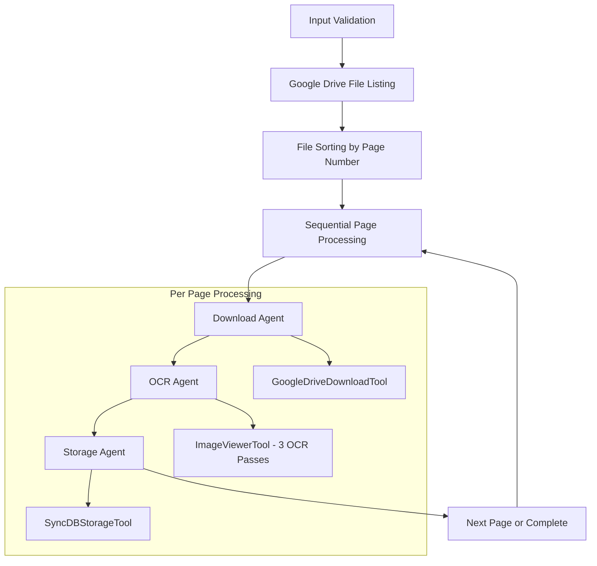

# Design Document

## Overview

The production-ready book ingestion crew is designed as a CrewAI-based system that processes handwritten manuscript images from Google Drive using a sequential, single-threaded approach. The system follows the KISS principle with three specialized agents working in a pipeline: file download, OCR processing, and database storage.

The architecture emphasizes reliability and maintainability by using standard CrewAI patterns, YAML-based configuration, and synchronous processing to avoid complexity and ensure predictable resource usage.

## Architecture

### High-Level Flow



### System Components

1. **Crew Orchestrator**: Main entry point using manual loop processing
2. **File Discovery Service**: Lists and sorts files from Google Drive
3. **Processing Pipeline**: Three-agent sequential workflow per page (single pass)
4. **Database Storage**: Synchronous PostgreSQL operations

### Agent Architecture

The system uses three specialized agents in a sequential pipeline:

- **Download Agent**: Retrieves individual files from Google Drive
- **OCR Coordinator Agent**: Manages the ImageViewerTool for text extraction
- **Storage Agent**: Persists transcribed data to PostgreSQL

## Components and Interfaces

### Input Schema

```json
{
  "job_key": "book_ingestion_crew",
  "client_user_id": "uuid",
  "actor_type": "string",
  "actor_id": "uuid", 
  "google_drive_folder_path": "string",
  "book_title": "string",
  "book_author": "string",
  "language": "string",
  "process_pages_limit": "integer (optional)"
}
```

### Agent Definitions (YAML-based)

```yaml
# agents.yaml
download_agent:
  role: "File Downloader"
  goal: "Download file from Google Drive"
  backstory: "Downloads one file efficiently"
  model: "gpt-4.1-nano"
  tools:
    - GoogleDriveDownloadTool

ocr_agent:
  role: "OCR Coordinator" 
  goal: "Extract text from image"
  backstory: "Uses OCR tool once"
  model: "gpt-4.1-nano"
  tools:
    - ImageViewerTool

storage_agent:
  role: "Data Storage Specialist"
  goal: "Store page in database"
  backstory: "Saves data to database"
  model: "gpt-4.1-nano"
  tools:
    - SyncDBStorageTool
```

```yaml
# tasks.yaml
download_task:
  description: "Download file using GoogleDriveDownloadTool"
  expected_output: "local_path"
  agent: download_agent

ocr_task:
  description: "Extract text using ImageViewerTool"
  expected_output: "transcription"
  agent: ocr_agent
  context: [download_task]

storage_task:
  description: "Store page using SyncDBStorageTool"
  expected_output: "success"
  agent: storage_agent
  context: [ocr_task]
```

### Tool Interfaces

#### GoogleDriveTool
- **Purpose**: List files in Google Drive folder (no downloads)
- **Input**: folder_path, client_user_id, download=False
- **Output**: JSON with file list including file_id, name, metadata

#### GoogleDriveDownloadTool  
- **Purpose**: Download individual files to temporary directory
- **Input**: file_id, file_name, client_user_id
- **Output**: local_path to downloaded file

#### ImageViewerTool
- **Purpose**: Perform 3-pass OCR using GPT-4o vision
- **Input**: image_path
- **Output**: JSON with transcription, statistics, unclear_sections
- **LLM Usage**: Exactly 3 calls to GPT-4o per image

#### SyncDBStorageTool
- **Purpose**: Store transcribed page data synchronously
- **Input**: client_user_id, book_key, page_number, file_name, language_code, page_text, ocr_metadata
- **Output**: JSON with success status and page_id

## Data Models

### BookIngestions Table Schema

```sql
CREATE TABLE book_ingestions (
    id UUID PRIMARY KEY DEFAULT gen_random_uuid(),
    book_key TEXT NOT NULL,
    page_number INTEGER NOT NULL,
    file_name TEXT NOT NULL,
    language_code TEXT NOT NULL,
    version TEXT NOT NULL DEFAULT 'original',
    page_text TEXT NOT NULL,
    ocr_metadata JSONB,
    created_at TIMESTAMP WITH TIME ZONE DEFAULT NOW(),
    updated_at TIMESTAMP WITH TIME ZONE DEFAULT NOW()
);
```

### OCR Metadata Structure

```json
{
  "file_id": "google_drive_file_id",
  "processing_stats": {
    "total_words": 150,
    "normal_transcription": 120,
    "context_logic_transcription": 25,
    "unable_to_transcribe": 5
  },
  "unclear_sections": ["word1", "phrase2"],
  "ocr_passes": 3,
  "model_used": "gpt-4o"
}
```

## Error Handling

### Input Validation
- Schema validation using Pydantic models
- Required field checking with descriptive error messages
- Language code validation against supported languages
- Google Drive URL/path format validation

### Processing Errors
- Individual page failures do not stop the entire process
- Error logging with context (page number, file name)
- Retry logic for transient failures (network, API rate limits)
- Graceful degradation for OCR quality issues

### Database Errors
- Connection failure handling with appropriate error messages
- Transaction rollback for failed page storage
- Duplicate page detection and handling
- Database constraint violation handling

### Resource Management
- Temporary file cleanup after processing
- Google Drive API credential caching per client
- Memory management for large image files
- Connection pooling for database operations

## Testing Strategy

### Unit Tests
- Individual tool testing with mock data
- Agent configuration validation
- Schema validation testing
- Error handling scenarios

### Integration Tests
- End-to-end processing with 5 test manuscript pages
- Google Drive API integration with test folder
- Database storage and retrieval verification
- OCR quality validation with known text samples

### Performance Tests
- LLM call counting (max 4 per page: 1 coordination + 3 OCR)
- Processing time measurement per page
- Memory usage monitoring during processing
- Database transaction performance

### Quality Assurance
- OCR accuracy validation against manual transcription
- Top-line capture verification (first 4-5 lines of each page)
- Language-specific character handling (Spanish accents, special characters)
- File format compatibility testing (PNG, JPG, JPEG, WEBP, GIF, BMP, TIFF)

### Test Data Requirements
- 5 manuscript pages with varying handwriting quality
- Pages with clear top lines for validation
- Mixed content (text, numbers, special characters)
- Different image formats and resolutions
- Test Google Drive folder with proper permissions

## Implementation Constraints

### CrewAI Standards Compliance
- YAML-based agent and task definitions (no hardcoded configurations)
- Standard OpenAI model usage (gpt-4.1-nano for coordination)
- Manual loop processing instead of CrewAI's kickoff_for_each method
- Sequential process type for predictable execution
- Minimal task descriptions to prevent extra LLM calls

### KISS Principle Adherence
- No custom process loops or complex orchestration
- Single-threaded sequential processing
- Minimal tool versions (one per function)
- Direct database operations without caching layers

### Resource Limitations
- Maximum 4 LLM calls per page (1 agent coordination + 3 OCR passes)
- Sequential file processing (no parallel downloads)
- Synchronous database operations
- Temporary file cleanup after each page

### Security Requirements
- Client-specific Google Drive credentials from database
- JWT authentication for API access
- Sensitive data sanitization in logs
- Secure temporary file handling with cleanup