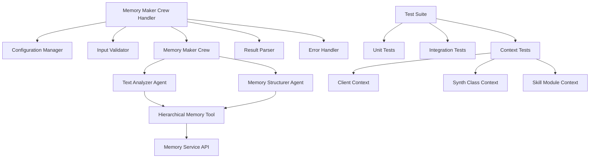

# Design Document

## Overview

The Memory Maker Crew Production Ready feature transforms the existing memory_maker_crew implementation into a robust, testable, and production-ready component. The design addresses critical issues including error handling, testing infrastructure, configuration management, and multi-context support for client, synth_class, and skill_module actor types.

## Architecture

### Current State Analysis

The existing implementation has several architectural issues:
- Hardcoded import paths and service URLs
- Missing comprehensive error handling
- Inadequate test coverage
- Inconsistent configuration management
- Limited validation for different actor contexts

### Target Architecture



## Components and Interfaces

### 1. Enhanced Configuration Management

**MemoryMakerConfig Class**
```python
class MemoryMakerConfig(BaseModel):
    memory_service_url: str = Field(default_factory=lambda: os.getenv("MEMORY_SERVICE_URL", "https://memory-external-development.up.railway.app"))
    api_secret_key: str = Field(default_factory=lambda: os.getenv("API_SECRET_KEY", ""))
    timeout_seconds: int = Field(default=30)
    retry_attempts: int = Field(default=3)
    retry_backoff_factor: float = Field(default=2.0)
    enable_debug_logging: bool = Field(default=False)
    
    # Context-specific settings
    supported_actor_types: List[str] = Field(default=["client", "synth", "human", "synth_class", "skill_module"])
    default_entity_types: List[str] = Field(default=["policy", "procedure", "organization", "concept", "skill"])
```

### 2. Input Validation and Schema Management

**Request Schema Validation**
```python
class MemoryMakerRequest(BaseModel):
    actor_type: Literal["client", "synth", "human", "synth_class", "skill_module"]
    actor_id: UUID
    text_content: str = Field(min_length=1, max_length=100000)
    metadata: Optional[Dict[str, Any]] = Field(default_factory=dict)
    
    @validator('text_content')
    def validate_text_content(cls, v):
        if not v.strip():
            raise ValueError('text_content cannot be empty or whitespace only')
        return v.strip()
```

**JSON Schema for object_schemas Table**
```json
{
  "type": "object",
  "properties": {
    "actor_type": {"type": "string", "enum": ["client", "synth", "human", "synth_class", "skill_module"]},
    "actor_id": {"type": "string", "format": "uuid"},
    "text_content": {"type": "string", "minLength": 1, "maxLength": 100000},
    "metadata": {"type": "object", "additionalProperties": true}
  },
  "required": ["actor_type", "actor_id", "text_content"],
  "additionalProperties": false
}
```

### 3. Enhanced Error Handling

**Error Handling Strategy**
- Retry logic with exponential backoff for API calls
- Structured error responses with error codes
- Comprehensive logging without sensitive data exposure
- Fail fast approach - no graceful degradation that creates data inconsistency

**Error Response Format**
```python
class MemoryMakerError(BaseModel):
    error_code: str
    error_message: str
    error_details: Optional[Dict[str, Any]] = None
    retry_after: Optional[int] = None
```

### 4. Multi-Context Testing Framework

**Test Data Structure**
```python
@dataclass
class TestContext:
    actor_type: str
    actor_id: str
    test_content: str
    expected_entities: List[str]
    expected_entity_types: List[str]
    
    def to_request_payload(self) -> Dict[str, Any]:
        return {
            "actor_type": self.actor_type,
            "actor_id": self.actor_id,
            "text_content": self.test_content
        }
```

**Test Contexts**
1. **Client Context**: Vervelyn Publishing corporate policy
   - Actor Type: "client"
   - Actor ID: "1d1c2154-242b-4f49-9ca8-e57129ddc823"
   - Content: Corporate policy document

2. **Synth Class Context**: Procedure templates and guidelines
   - Actor Type: "synth_class"
   - Actor ID: "24"
   - Content: Standard operating procedures for blog writing

3. **Skill Module Context**: Skill-specific knowledge
   - Actor Type: "skill_module"
   - Actor ID: Generated test ID (requires skill_module table creation)
   - Content: Technical skill documentation for content analysis

## Data Models

### Enhanced Memory Entity Structure

```python
class MemoryEntity(BaseModel):
    entity_name: str
    entity_type: str
    observations: List[MemoryObservation]
    metadata: Dict[str, Any]
    context_source: str  # "own", "synth_class", "client"
    confidence_score: Optional[float] = None
```

### Memory Processing Result

```python
class MemoryProcessingResult(BaseModel):
    status: Literal["completed", "failed", "partial"]
    entities_created: List[MemoryEntity]
    entities_updated: List[MemoryEntity]
    observations_added: List[MemoryObservation]
    relationships_created: List[MemoryRelationship]
    processing_metadata: ProcessingMetadata
    errors: List[MemoryMakerError] = Field(default_factory=list)
```

## Error Handling

### Retry Strategy

```python
class RetryConfig:
    max_attempts: int = 3
    base_delay: float = 1.0
    max_delay: float = 60.0
    backoff_factor: float = 2.0
    retryable_errors: List[Type[Exception]] = [
        httpx.TimeoutException,
        httpx.ConnectError,
        httpx.HTTPStatusError  # for 5xx errors only
    ]
```

### Error Categories

1. **Validation Errors**: Input validation failures (non-retryable)
2. **Service Errors**: Memory service unavailable (retryable)
3. **Processing Errors**: Crew execution failures (partially retryable)
4. **Configuration Errors**: Missing or invalid configuration (non-retryable)

## Testing Strategy

### Unit Tests

1. **Configuration Tests**
   - Validate configuration loading from environment
   - Test configuration validation and defaults

2. **Input Validation Tests**
   - Test request schema validation
   - Test edge cases and boundary conditions

3. **Error Handling Tests**
   - Test retry logic with mocked failures
   - Test error response formatting

### Integration Tests

1. **Memory Service Integration**
   - Test successful memory creation
   - Test direct memory service connection (no service discovery)
   - Test authentication and authorization

2. **Crew Execution Tests**
   - Test full crew execution pipeline
   - Test result parsing and structuring

### Context-Specific Tests

1. **Client Context Test**
   - Process Vervelyn Publishing corporate policy
   - Validate policy entities and relationships
   - Test organizational memory storage
   - **Memory Verification**: Use chat API to verify LLM can access and reference stored policy information

2. **Synth Class Context Test**
   - Process procedure templates
   - Validate template entity creation
   - Test hierarchical memory access
   - **Memory Verification**: Test chat responses include synth_class template knowledge

3. **Skill Module Context Test**
   - Process skill documentation
   - Validate skill entity creation
   - Test skill-specific memory patterns
   - **Memory Verification**: Validate chat responses demonstrate skill-specific knowledge access

### Memory Verification Strategy

After memory creation, validate success through conversational testing:

```python
class MemoryVerificationTest:
    async def verify_memory_integration(self, actor_context: TestContext):
        """Verify memories are accessible through chat interface."""
        
        # 1. Create test conversation
        chat_payload = {
            "actor_type": actor_context.actor_type,
            "actor_id": actor_context.actor_id,
            "message": "What do you know about the corporate policy we just discussed?",
            "conversation_id": str(uuid4())
        }
        
        # 2. Send chat request
        response = await self.chat_client.post("/chat", json=chat_payload)
        
        # 3. Validate response contains policy information
        assert "Vervelyn Publishing" in response.text
        assert "Memory Makers" in response.text
        assert "corporate policy" in response.text.lower()
        
        return response
```

### Interactive Testing Approach

For manual verification during development:
1. Execute memory maker crew with test data
2. Use interactive chat session to query stored memories
3. Validate LLM responses demonstrate access to stored information
4. Test different query patterns to ensure comprehensive memory access

## Performance Considerations

### Resource Management

- Connection pooling for HTTP clients
- Timeout configuration for long-running operations
- Memory usage monitoring for large text processing

### Scalability

- Asynchronous processing where possible
- Configurable batch sizes for large documents
- Rate limiting compliance with external services

## Security Considerations

### Data Protection

- Sanitize sensitive data from logs
- Validate actor context permissions
- Secure JWT token generation and validation

### Access Control

- Enforce actor context boundaries
- Validate client permissions for memory access
- Audit trail for memory operations

## Deployment Considerations

### Environment Configuration

All required environment variables should already exist in the current .env file:

```bash
# Required (should already exist)
API_SECRET_KEY=<jwt-secret>
MEMORY_SERVICE_URL=https://memory-external-development.up.railway.app
DATABASE_URL=<database-connection-string>

# Optional configuration (new)
MEMORY_MAKER_TIMEOUT=30
MEMORY_MAKER_RETRY_ATTEMPTS=3
MEMORY_MAKER_DEBUG=false
```

### Database Schema Updates

1. **Create skill_module table** (required for skill_module context testing):
```sql
CREATE TABLE IF NOT EXISTS skill_modules (
    id UUID PRIMARY KEY DEFAULT gen_random_uuid(),
    name VARCHAR(255) NOT NULL,
    description TEXT,
    version VARCHAR(50),
    active BOOLEAN DEFAULT true,
    metadata JSONB DEFAULT '{}',
    created_at TIMESTAMP WITH TIME ZONE DEFAULT NOW(),
    updated_at TIMESTAMP WITH TIME ZONE DEFAULT NOW()
);
```

2. **Update object_schemas table** to support all actor types:
```sql
UPDATE object_schemas 
SET schema = jsonb_set(
    schema,
    '{properties,actor_type,enum}',
    '["synth", "human", "client", "synth_class", "skill_module"]'::jsonb
),
updated_at = NOW()
WHERE name = 'memory_maker_crew' AND object_type = 'crew';
```

## Monitoring and Observability

### Logging Strategy

- Structured logging with correlation IDs
- Performance metrics (processing time, memory usage)
- Error tracking with context preservation
- Debug logging for development environments

### Health Checks

- Memory service connectivity
- Database connectivity
- Configuration validation