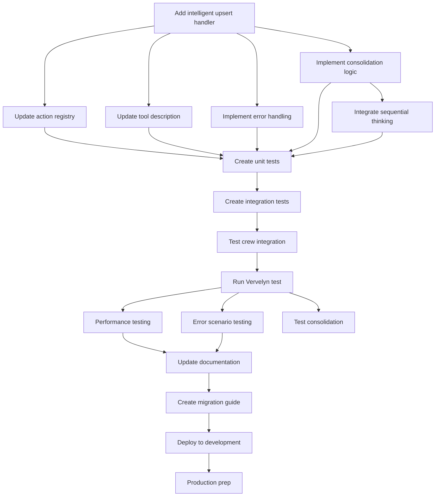

# Implementation Tasks

## Current Status: Basic Implementation COMPLETE ✅

**As of 2025-01-24**: The basic `upsert_entity` action has been implemented and is working. The Memory Maker Crew can now use this action to create or update entities. Advanced consolidation features (Tasks 1.5-1.6) are deferred for future implementation.

## Overview

This document outlines the specific tasks required to implement an intelligent `upsert_entity` action with memory consolidation capabilities. The implementation includes memory graph analysis, sequential thinking integration, and intelligent consolidation strategies to optimize memory storage.

## Tasks

### Phase 1: Tool Implementation

- [x] **Task 1.1**: Add intelligent `upsert_entity` handler method
  - Location: `tools/sj_memory_tool_hierarchical.py`
  - ✅ Implemented `_upsert_entity` method (basic version without consolidation)
  - ✅ Added parameter validation
  - ✅ Mapped crew format to API format
  - ⏳ Memory graph loading deferred to Phase 1.5
  - Dependencies: None
  - Actual time: 45 minutes
  - Status: COMPLETED (basic implementation)

- [x] **Task 1.2**: Update action registry
  - ✅ Added `upsert_entity` to the actions dictionary
  - ✅ Verified proper method binding
  - Dependencies: Task 1.1
  - Actual time: 5 minutes
  - Status: COMPLETED

- [x] **Task 1.3**: Update tool description
  - ✅ Added upsert_entity to tool description
  - ✅ Added example usage in the docstring
  - ✅ Updated error messages to include upsert_entity
  - Dependencies: Task 1.1
  - Actual time: 10 minutes
  - Status: COMPLETED

- [x] **Task 1.4**: Implement error handling
  - ✅ Added error handling for missing parameters
  - ✅ Added logging for success and failure cases
  - ✅ Returns consistent error format
  - ⏳ Retry logic deferred (not needed for basic implementation)
  - Dependencies: Task 1.1
  - Actual time: 15 minutes
  - Status: COMPLETED (basic error handling)

- [ ] **Task 1.5**: Implement memory consolidation logic
  - Add `_analyze_for_consolidation` method
  - Implement `_apply_consolidation` method
  - Create `_build_graph_structure` method
  - Add statistical observation detection
  - Dependencies: Task 1.1
  - Estimated time: 4 hours

- [ ] **Task 1.6**: Integrate sequential thinking service
  - Add thinking client configuration
  - Implement consolidation analysis prompts
  - Parse consolidation results
  - Add fallback for when thinking unavailable
  - Dependencies: Task 1.5
  - Estimated time: 2 hours

### Phase 2: Testing

- [ ] **Task 2.1**: Create unit tests for intelligent upsert
  - Location: `tests/test_memory_tool_hierarchical.py`
  - Test successful entity creation
  - Test successful entity update with consolidation
  - Test memory graph loading
  - Test statistical observation updates
  - Test observation merging
  - Test realm isolation
  - Test parameter validation
  - Test error handling
  - Dependencies: Task 1.1-1.6
  - Estimated time: 4 hours

- [ ] **Task 2.2**: Create integration tests
  - Test end-to-end upsert flow with actual Memory Service
  - Verify entity state after upsert
  - Test with various entity types
  - Dependencies: Task 2.1
  - Estimated time: 1.5 hours

- [ ] **Task 2.3**: Test Memory Maker Crew integration
  - Run crew with test payload
  - Verify upsert_entity is called correctly
  - Check created entities match expectations
  - Dependencies: Task 2.1, 2.2
  - Estimated time: 1 hour

### Phase 3: Validation

- [ ] **Task 3.1**: Run Vervelyn policy test
  - Execute Memory Maker Crew with Vervelyn corporate policy
  - Verify all expected entities are created
  - Check observation content and metadata
  - Dependencies: All Phase 2 tasks
  - Estimated time: 1 hour

- [ ] **Task 3.2**: Performance testing
  - Test upsert with large observation sets
  - Measure response times
  - Verify no duplicate API calls
  - Dependencies: Task 3.1
  - Estimated time: 1 hour

- [ ] **Task 3.3**: Error scenario testing
  - Test with memory service down
  - Test with invalid authentication
  - Test with malformed requests
  - Verify graceful error handling
  - Dependencies: Task 3.1
  - Estimated time: 1 hour

### Phase 4: Documentation

- [ ] **Task 4.1**: Update tool documentation
  - Document upsert_entity action in tool docstring
  - Add examples to crew configuration guide
  - Update README if applicable
  - Dependencies: All Phase 3 tasks
  - Estimated time: 1 hour

- [ ] **Task 4.2**: Create migration guide
  - Document how to update existing crews
  - Explain when to use upsert vs create
  - Include troubleshooting section
  - Dependencies: Task 4.1
  - Estimated time: 45 minutes

### Phase 5: Deployment

- [ ] **Task 5.1**: Deploy to development environment
  - Update tool in development
  - Run smoke tests
  - Monitor logs for errors
  - Dependencies: All Phase 4 tasks
  - Estimated time: 30 minutes

- [ ] **Task 5.2**: Production deployment preparation
  - Create deployment checklist
  - Prepare rollback plan
  - Document monitoring requirements
  - Dependencies: Task 5.1
  - Estimated time: 1 hour

- [ ] **Task 3.4**: Test memory consolidation effectiveness
  - Create test data with redundant information
  - Verify statistics are updated not duplicated
  - Confirm observation merging works correctly
  - Measure memory size before/after consolidation
  - Dependencies: Task 3.1
  - Estimated time: 2 hours

## Task Dependencies

## Total Time Estimates

### Original Simple Upsert: ~14.5 hours
### Intelligent Upsert with Consolidation: ~28 hours

#### Phase 1 Progress (Tool Implementation):
- **Completed**: Tasks 1.1-1.4 (Basic upsert implementation)
- **Time spent**: 1.25 hours
- **Remaining**: Tasks 1.5-1.6 (Consolidation features) - ~6 hours
- **Status**: Basic upsert is WORKING and ready for use

#### Remaining Phases:
- Phase 2 (Testing): 6.5 hours
- Phase 3 (Validation): 5 hours
- Phase 4 (Documentation): 1.75 hours
- Phase 5 (Deployment): 1.5 hours

The increased complexity comes from:
- Memory graph loading and analysis
- Sequential thinking integration
- Consolidation logic implementation
- More comprehensive testing requirements
- Realm isolation verification

## Success Criteria

1. **Functional Success**:
   - Memory Maker Crew successfully processes Vervelyn policy
   - All expected entities are created with correct observations
   - No manual intervention required

2. **Technical Success**:
   - All tests pass with >90% code coverage
   - Memory consolidation reduces storage by >50% for redundant data
   - Performance meets <2 second response time requirement

3. **Operational Success**:
   - Clear documentation for developers
   - Comprehensive error messages for debugging
   - Monitoring in place for production

## Risk Mitigation

1. **Risk**: Memory consolidation complexity
   - **Mitigation**: Start with simple consolidation rules
   - **Mitigation**: Feature flag to disable consolidation if needed

2. **Risk**: Performance degradation
   - **Mitigation**: Load testing before production
   - **Mitigation**: Implement caching if needed

3. **Risk**: Memory Service API changes
   - **Mitigation**: Version checking in tool
   - **Mitigation**: Graceful fallback behavior