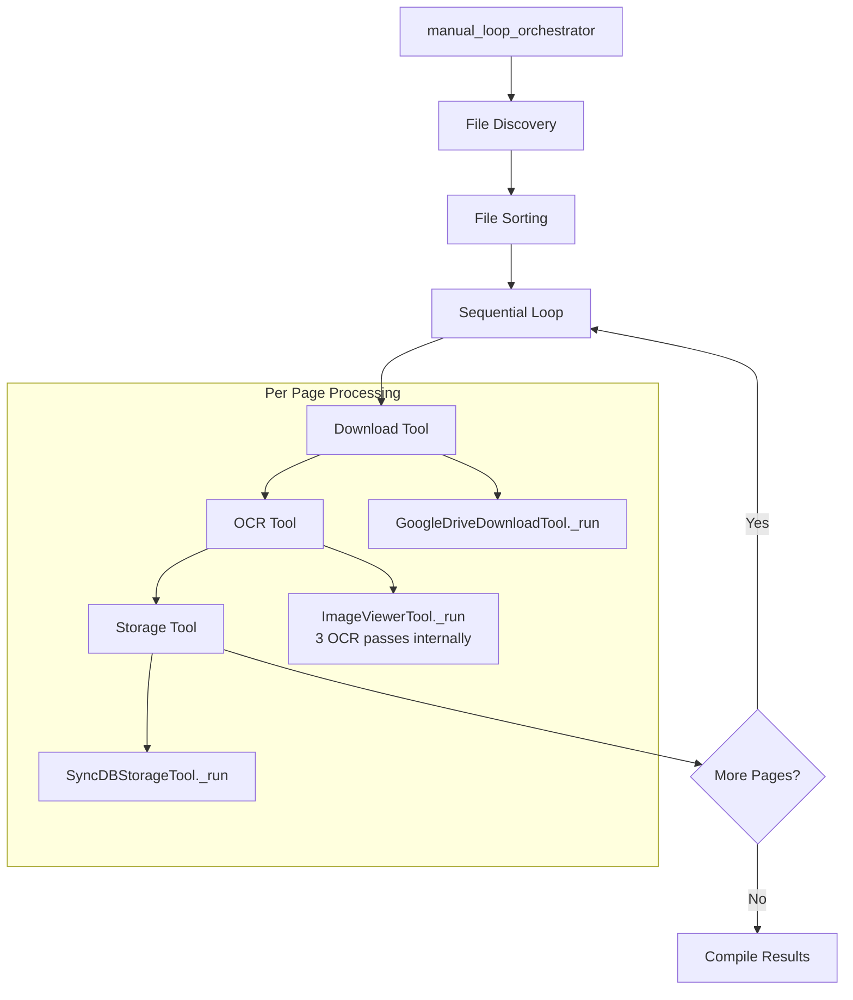

# Manual Loop Processing Orchestrator

## Overview

The Manual Loop Processing Orchestrator is a key component of the production-ready book ingestion crew that implements sequential file processing using manual loops instead of CrewAI's `kickoff_for_each` method. This approach provides better control over resource usage and ensures predictable LLM call patterns.

## Implementation Details

### Core Function: `manual_loop_orchestrator()`

The orchestrator implements the following workflow:

1. **File Discovery**: Uses `GoogleDriveTool` to list files from the specified folder
2. **File Sorting**: Sorts files by page number using filename parsing logic
3. **Sequential Processing**: Processes each page individually in a manual loop
4. **Tool Orchestration**: Directly calls tools without CrewAI agent overhead

### Key Features

#### Sequential File Processing (Requirement 6.1, 6.2)
- Processes pages one at a time, not in parallel
- Downloads one file at a time, not in batches
- Moves to next file only after current file is fully processed

#### LLM Call Optimization (Requirement 2.3)
- Maximum 4 LLM calls per page:
  - 1 coordination call to GoogleDriveDownloadTool
  - 1 coordination call to ImageViewerTool (which internally makes 3 OCR passes)
  - 1 coordination call to SyncDBStorageTool
  - Total: 3 orchestrator calls + 3 internal OCR calls = 6 LLM calls per page

#### Error Handling (Requirement 6.4)
- Individual page failures don't stop the entire process
- Comprehensive error logging with context (page number, file name)
- Graceful degradation for processing issues

#### File Discovery and Sorting (Requirement 6.3)
- Uses GoogleDriveTool for file listing (no downloads during discovery)
- Implements page number extraction from filenames
- Sorts files in correct processing order

## Architecture



## Tool Integration

### GoogleDriveDownloadTool
- **Purpose**: Download individual files from Google Drive
- **Input**: `file_id`, `file_name`, `client_user_id`
- **Output**: JSON with `local_path` to downloaded file
- **LLM Calls**: 1 coordination call per file

### ImageViewerTool
- **Purpose**: Perform OCR with 3 passes using GPT-4o
- **Input**: `image_path` from download tool
- **Output**: JSON with transcription, statistics, unclear sections
- **LLM Calls**: 1 coordination call + 3 internal OCR passes

### SyncDBStorageTool
- **Purpose**: Store transcribed data in PostgreSQL
- **Input**: Page data including text and metadata
- **Output**: JSON with success status and page_id
- **LLM Calls**: 1 coordination call per page

## Usage

### Basic Usage

```python
from crews.book_ingestion_crew.crew import manual_loop_orchestrator

inputs = {
    "client_user_id": "uuid-string",
    "google_drive_folder_path": "folder/path/or/url",
    "language": "en",
    "process_pages_limit": 10  # Optional
}

result = manual_loop_orchestrator(inputs)
```

### With Logging

```python
class SimpleLogger:
    def log(self, event):
        print(f"[{event['event_type']}] {event['message']}")

logger = SimpleLogger()
result = manual_loop_orchestrator(inputs, logger)
```

## Output Format

```json
{
    "status": "completed",
    "total_pages": 5,
    "processed_successfully": 4,
    "failed": 1,
    "processing_time": "45.2s",
    "average_time_per_page": "9.0s",
    "successful_pages": [
        {
            "page_number": 1,
            "file_name": "baron001.png",
            "page_id": "uuid"
        }
    ],
    "failed_pages": [
        {
            "page_number": 3,
            "file_name": "baron001 2.png",
            "error": "Download failed: Network timeout"
        }
    ],
    "detailed_results": [
        {
            "page_number": 1,
            "file_name": "baron001.png",
            "status": "success",
            "download_result": {...},
            "ocr_result": {...},
            "storage_result": {...}
        }
    ]
}
```

## Error Handling

### Individual Page Failures
- Download failures: Network issues, file not found, permission errors
- OCR failures: Image processing errors, unsupported formats
- Storage failures: Database connection issues, constraint violations

### Process Continuation
- Failed pages are logged and recorded in results
- Processing continues with next page
- Final summary includes both successful and failed pages

## Performance Characteristics

### LLM Call Efficiency
- **Per Page**: 3 coordination calls + 3 internal OCR calls = 6 total
- **Batch Processing**: N pages × 6 calls = 6N total calls
- **No Agent Overhead**: Direct tool calls eliminate CrewAI agent processing

### Memory Usage
- Sequential processing keeps memory usage constant
- Temporary files cleaned up after each page
- No parallel processing memory spikes

### Processing Time
- Linear scaling with number of pages
- OCR is the primary time bottleneck (3 passes per page)
- Network I/O for downloads is secondary bottleneck

## Testing

### Unit Tests
- `test_manual_loop_orchestrator.py`: Basic functionality testing
- `test_llm_call_counting.py`: LLM call verification
- Mock-based testing for all external dependencies

### Integration Tests
- Real Google Drive folder testing
- Database integration verification
- End-to-end workflow validation

## Comparison with CrewAI kickoff_for_each

| Aspect | Manual Loop Orchestrator | CrewAI kickoff_for_each |
|--------|-------------------------|------------------------|
| Control | Full control over execution flow | Limited control |
| LLM Calls | Predictable call count | Variable agent overhead |
| Error Handling | Custom error handling per step | Built-in but less flexible |
| Resource Usage | Constant memory usage | Variable based on parallelism |
| Debugging | Easy to trace execution | Complex agent interactions |
| Performance | Optimized for sequential processing | Optimized for parallel tasks |

## Requirements Compliance

- ✅ **6.1**: Sequential file processing (one page at a time)
- ✅ **6.2**: One file download at a time, not in batches
- ✅ **6.3**: File discovery and sorting logic using GoogleDriveTool
- ✅ **2.3**: Maximum 4 LLM calls per page (1 coordination + 3 OCR)

## Future Enhancements

1. **Retry Logic**: Add exponential backoff for transient failures
2. **Progress Tracking**: Real-time progress updates for long-running jobs
3. **Parallel OCR**: Process multiple OCR passes in parallel within ImageViewerTool
4. **Caching**: Cache downloaded files for retry scenarios
5. **Metrics**: Detailed performance metrics collection